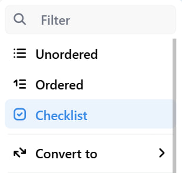
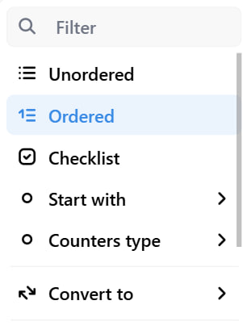

# Nested List Tool for Editor.js

Multi-leveled lists for the [Editor.js](https://editorjs.io).

Use `Tab` and `Shift+Tab` keys to create or remove sublist with a padding.


## Installation

Get the package

```shell
yarn add @editorjs/nested-list
```

Include module at your application

```javascript
import NestedList from '@editorjs/nested-list';
```

Optionally, you can load this tool from CDN [JsDelivr CDN](https://cdn.jsdelivr.net/npm/@editorjs/nested-list@latest)

## Usage

Add the NestedList Tool to the `tools` property of the Editor.js initial config.

```javascript
import EditorJS from '@editorjs/editorjs';
import NestedList from '@editorjs/nested-list';

var editor = EditorJS({
  // ...
  tools: {
    ...
    list: {
      class: NestedList,
      inlineToolbar: true,
      config: {
        defaultStyle: 'unordered'
      },
    },
  },
});
```

## Config Params

| Field        | Type     | Description                                                    |
|--------------|----------|----------------------------------------------------------------|
| defaultStyle | `string` | default list style: `ordered`, `unordered` or `checklist`, default is `unordered` |

## Default list params

| Field        | Type     | Description                                                                       |
|--------------|----------|-----------------------------------------------------------------------------------|
| style        | `string` | list will be rendered with this style: `ordered`, `unordered` or `checklist`, default is `defaultStyle` from tool config |

This params are supported in Ordered List and Checklist

## Ordered list params

| Field        | Type     | Description                                                                       |
|--------------|----------|-----------------------------------------------------------------------------------|
| start        | `number` | list will start with this number, default is `1`                                  |
| maxLevel     | `number` | maximum level of the list nesting, could be set to `1` to disable nesting, unlimited by default |
| counterType  | `string` | type of the counters: `numeric`, `lower-roman`, `upper-roman`, `lower-alpha`, `upper-alpha`, default is `numeric` |


## Default Tool's settings



- You can choose list`s type.

## Ordered list Tool's settings



- You can choose the number for list to start with.
- You can choose type of the counters.

## Default Output data

| Field | Type      | Description                              |
| ----- | --------- | ---------------------------------------- |
| style | `string`  | type of a list: `ordered` or `unordered` |
| items | `Item[]`  | the array of list's items                |

Object `ItemMeta` for Checklist:

| Field   | Type      | Description               |
| ------- | --------- | ------------------------- |
| checked | `boolean` | state of the checkbox     |

Object `ItemMeta` for Ordered and Unordered lists would be empty.

Object `Item`:

| Field   | Type      | Description                 |
| ------- | --------- | -------------------------   |
| content | `string`  | item's string content       |
| meta    | `ItemMeta`| meta information about item |
| items   | `Item[]`  | the array of list's items   |


## Example of the content for `Unordered List`
```json
{
    "type" : "list",
    "data" : {
        "style": "unordered",
        "maxLevel": 1,
        "items": [
            {
              "content": "Apples",
              "meta": {},
              "items": [
                {
                  "content": "Red",
                  "meta": {},
                  "items": []
                },
                {
                  "content": "Green",
                  "meta": {},
                  "items": []
                },
              ]
            },
            {
              "content": "Bananas",
              "meta": {},
              "items": [
                {
                  "content": "Yellow",
                  "meta": {},
                  "items": []
                },
              ]
            },
        ]
    }
},
```

## Example of the content for `Ordered List`
```json
{
    "type" : "list",
    "data" : {
        "style": "ordered",
        "start": 2,
        "counterType": "upper-roman",
        "maxLevel": 4,
        "items" : [
            {
              "content": "Apples",
              "meta": {},
              "items": [
                {
                  "content": "Red",
                  "meta": {},
                  "items": []
                },
                {
                  "content": "Green",
                  "meta": {},
                  "items": []
                },
              ]
            },
            {
              "content": "Bananas",
              "meta": {},
              "items": [
                {
                  "content": "Yellow",
                  "meta": {},
                  "items": []
                },
              ]
            },
        ]
    }
},
```

## Example of the content for `Checklist`
```json
{
    "type" : "list",
    "data" : {
        "style": "checklist",
        "maxLevel": 4,
        "items" : [
            {
              "content": "Apples",
              "meta": {
                "checked": false
              },
              "items": [
                {
                  "content": "Red",
                  "meta": {
                    "checked": true
                  },
                  "items": []
                },
                {
                  "content": "Green",
                  "meta": {
                    "checked": false
                  },
                  "items": []
                },
              ]
            },
            {
              "content": "Bananas",
              "meta": {
                "checked": true
              },
              "items": [
                {
                  "content": "Yellow",
                  "meta": {
                    "checked": true
                  },
                  "items": []
                },
              ]
            },
        ]
    }
},
```
