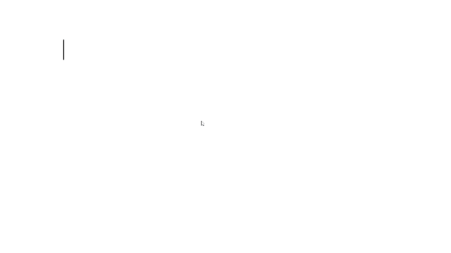

# Editorjs List Tool

- 🤩 Part of [Editor.js](https://editorjs.io/) ecosystem.
- 📂 Nesting.
- 🔥 Ordered and Unordered lists.
- ✅ Checklists.
- 🔢 Customizable start number.
- 🏛️ Customizable counter type (e.g. `lower-roman`).
- 🪜 Max nesting level configuration.
- 📝 Compatible with [List](https://github.com/editor-js/list) and [Checklist](https://github.com/editor-js/checklist).



Use `Tab` and `Shift+Tab` keys to create or remove sublist with a padding.

## Installation

Get the package

```shell
yarn add @editorjs/list
```

Include module at your application

```javascript
import List from '@editorjs/list';
```

Optionally, you can load this tool from CDN [JsDelivr CDN](https://cdn.jsdelivr.net/npm/@editorjs/list@latest)

## Usage

Add the List Tool to the `tools` property of the Editor.js initial config.

```javascript
import EditorJS from '@editorjs/editorjs';
import List from '@editorjs/list';

var editor = EditorJS({
  // ...
  tools: {
    ...
    list: {
      class: List,
      inlineToolbar: true,
      config: {
        defaultStyle: 'unordered'
      },
    },
  },
});
```

## Config Params

| Field        | Type     | Description                                                    |
|--------------|----------|----------------------------------------------------------------|
| defaultStyle | `string` | default list style: `ordered`, `unordered` or `checklist`, default is `unordered` |
| maxLevel     | `number` | maximum level of the list nesting, could be set to `1` to disable nesting, unlimited by default |

## Output data

| Field             | Type      |  Description                                                                                                              |
| ----------------- | --------- | ------------------------------------------------------------------------------------------------------------------------- |
| style             | `string`  |  list will be rendered with this style: `ordered`, `unordered` or `checklist`, default is `defaultStyle` from tool config |
| meta              | `ItemMeta`|  Item meta based on the list style                                                                                         |
| items             | `Item[]`  |  the array of list's items                                                                                                |

Object `Item`:

| Field   | Type       | Description                 |
| ------- | ---------- | --------------------------- |
| content | `string`   | item's string content       |
| meta    | `ItemMeta` | meta information about item |
| items   | `Item[]`   | the array of list's items   |

Object `ItemMeta` for Checklist:

| Field   | Type      | Description               |
| ------- | --------- | ------------------------- |
| checked | `boolean` | state of the checkbox     |

Object `ItemMeta` for Ordered list

| Field   | Type      | Description               |
| ------- | --------- | ------------------------- |
| start   | `number`  | number for list to start with, default is 1 |
| counterType | `string`  | counter type for list, it could be `numeric`, `lower-roman`, `upper-roman`, `lower-alpha`, `upper-alpha`, default is `numeric` |


Object `ItemMeta` for Unordered list would be empty.


## Example of the content for `Unordered List`
```json
{
  "type" : "list",
  "data" : {
    "style": "unordered",
    "items": [
      {
        "content": "Apples",
        "meta": {},
        "items": [
          {
            "content": "Red",
            "meta": {},
            "items": []
          },
        ]
      },
    ]
  }
},
```

## Example of the content for `Ordered List`
```json
{
  "type" : "list",
  "data" : {
    "style": "ordered",
    "meta": {
      "start": 2,
      "counterType": "upper-roman",
    },
    "items" : [
      {
        "content": "Apples",
        "meta": {},
        "items": [
          {
            "content": "Red",
            "meta": {},
            "items": []
          },
        ]
      },
    ]
  }
},
```

## Example of the content for `Checklist`
```json
{
  "type" : "list",
  "data" : {
    "style": "checklist",
    "items" : [
      {
        "content": "Apples",
        "meta": {
          "checked": false
        },
        "items": [
          {
            "content": "Red",
            "meta": {
              "checked": true
            },
            "items": []
          },
        ]
      },
    ]
  }
},
```
