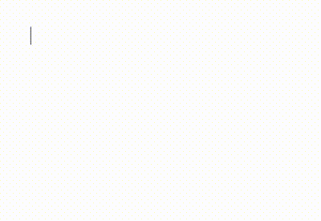
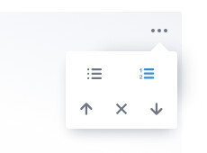

# Nested List Tool for Editor.js

Multi-leveled lists for the [Editor.js](https://editorjs.io).

Use `Tab` and `Shift+Tab` keys to create or remove sublist with a padding.



## Installation

Get the package

```shell
yarn add @editorjs/nested-list
```

Include module at your application

```javascript
import NestedList from '@editorjs/nested-list';
```

Optionally, you can load this tool from CDN [JsDelivr CDN](https://cdn.jsdelivr.net/npm/@editorjs/nested-list@latest)

## Usage

Add the NestedList Tool to the `tools` property of the Editor.js initial config.

```javascript
import EditorJS from '@editorjs/editorjs';
import NestedList from '@editorjs/nested-list';

var editor = EditorJS({
  // ...
  tools: {
    ...
    list: {
      class: NestedList,
      inlineToolbar: true,
      config: {
        defaultStyle: 'unordered'
      },
    },
  },
});
```

## Config Params

| Field        | Type     | Description                                                    |
|--------------|----------|----------------------------------------------------------------|
| defaultStyle | `string` | default list style: `ordered` or `unordered`, default is `unordered` |

## Tool's settings



You can choose list`s type.

## Output data

| Field | Type      | Description                              |
| ----- | --------- | ---------------------------------------- |
| style | `string`  | type of a list: `ordered` or `unordered` |
| items | `Item[]`  | the array of list's items                |

Object `Item`:

| Field   | Type      | Description               |
| ------- | --------- | ------------------------- |
| content | `string`  | item's string content     |
| items   | `Item[]`  | the array of list's items |


```json
{
    "type" : "list",
    "data" : {
        "style" : "unordered",
        "items" : [
            {
              "content": "Apples",
              "items": [
                {
                  "content": "Red",
                  "items": []
                },
                {
                  "content": "Green",
                  "items": []
                },
              ]
            },
            {
              "content": "Bananas",
              "items": [
                {
                  "content": "Yellow",
                  "items": []
                },
              ]
            },
        ]
    }
},
```
